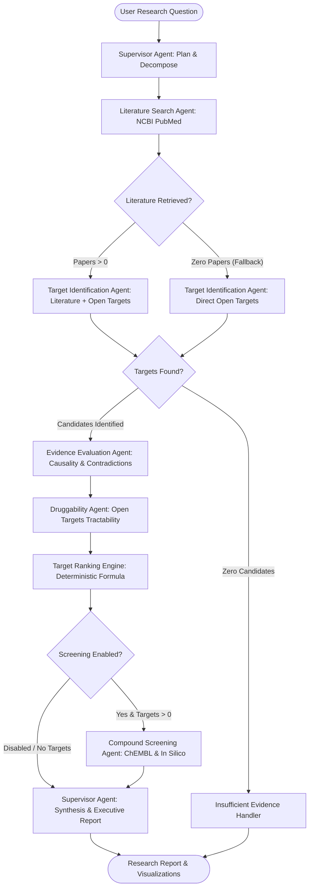

# Drug Discovery & Target Identification Agent

An AI-powered biomedical research platform that searches scientific literature, identifies candidate therapeutic targets, evaluates multi-modal evidence, assesses druggability, performs compound/bioactivity analysis, and deterministically prioritizes targets.

> [!IMPORTANT]
> **RESEARCH USE & SCIENTIFIC SCOPE**:
> This software is an engineering and research support platform for target hypothesis generation, literature synthesis, and multi-modal evidence prioritization. It is **not** a clinical diagnostic tool, does **not** provide medical advice or clinical recommendations, and does **not** replace laboratory experimental validation or pharmaceutical regulatory processes. Computational predictions are explicitly labeled and must be empirically validated in wet-lab assays.

---

## Table of Contents

- [Overview](#overview)
- [Key Capabilities](#key-capabilities)
- [System Architecture](#system-architecture)
  - [Workflow Topology](#workflow-topology)
  - [Deterministic vs. Agentic Responsibilities](#deterministic-vs-agentic-responsibilities)
- [Scientific Integrity & Provenance](#scientific-integrity--provenance)
- [Technology Stack](#technology-stack)
- [Repository Structure](#repository-structure)
- [Installation & Setup](#installation--setup)
  - [Prerequisites](#prerequisites)
  - [Clone & Virtual Environment](#clone--virtual-environment)
  - [Dependency Installation](#dependency-installation)
  - [Environment Configuration](#environment-configuration)
- [Running the Platform](#running-the-platform)
  - [Interactive Streamlit Dashboard](#interactive-streamlit-dashboard)
  - [FastAPI REST Service](#fastapi-rest-service)
- [User Guide & Demonstration Presets](#user-guide--demonstration-presets)
  - [Step-by-Step Workflow](#step-by-step-workflow)
  - [Demonstration Presets](#demonstration-presets)
- [Testing & Verification](#testing--verification)
- [Phased Development Progression](#phased-development-progression)
- [Limitations & Boundaries](#limitations--boundaries)
- [External Data Sources](#external-data-sources)
- [Security & Secrets Policy](#security--secrets-policy)
- [Contributing](#contributing)
- [License](#license)

---

## Overview

Therapeutic target identification is a central challenge in early-stage drug discovery. Biomedical evidence is typically fragmented across disparate repositories:
- Unstructured scientific literature (**NCBI PubMed / PMC**)
- Curated genomic and disease association platforms (**Open Targets Platform**)
- Empirical pharmacology and bioactivity databases (**EMBL-EBI ChEMBL**)
- Proprietary internal wet-lab assays (CRISPR knockout screens, RNA-seq, binding kinetics)

Traditional discovery workflows suffer from information silos, over-interpretation of co-occurrence as causality, unflagged contradictory findings across publications, and opaque heuristic scoring.

The **Drug Discovery & Target Identification Agent** resolves these challenges through a stateful multi-agent system orchestrated via **LangGraph**. It automates multi-modal evidence collection while strictly decoupling **qualitative scientific reasoning** from **deterministic numerical scoring**, ensuring explainable, reproducible target rankings backed by complete bibliographic provenance.

---

## Key Capabilities

- **Biomedical Literature Retrieval**: Automated search and retrieval of peer-reviewed articles and abstracts via NCBI E-utilities with rate-limiting, retry pacing, and persistent PMID/PMCID tracking.
- **Target Identification & Normalization**: Entity extraction of candidate genes and proteins with automated normalization to standardized HGNC symbols and Ensembl Gene Identifiers (`ENSG...`).
- **Open Targets Integration**: Direct GraphQL querying of target-disease association scores, genetic evidence, and clinical tractability profiles.
- **Rigorous Evidence Evaluation**:
  - *Causality Boundaries*: Enforces the scientific rule that literature co-occurrence is never treated as proof of causality.
  - *Contradiction Detection*: Automatically detects opposing directions of effect (e.g., protective vs. risk-increasing variants) across studies and applies deterministic scoring penalties.
- **Multi-Modal Tractability Profiling**: Assesses clinical precedence and druggability across small molecules, monoclonal antibodies, and targeted protein degraders (PROTACs).
- **Internal Experimental Assay Ingestion**: Ingests and schema-validates internal cellular viability, gene expression, and biophysical binding assays with strict quality-control checks.
- **Empirical Bioactivity Retrieval**: Queries verified wet-lab measurements (`IC50`, `Ki`, `Kd`, `EC50` in nM) from ChEMBL with assay and publication provenance.
- **In Silico Physicochemical Screening**: Performs deterministic computational binding simulations, Lipinski rule evaluations, and theoretical affinity estimations accompanied by mandatory simulation disclaimers.
- **Deterministic 6-Factor Scoring Engine**: Computes composite priority scores (0–100) using configurable mathematical weights outside of the LLM, eliminating score hallucinations.
- **Stateful LangGraph Orchestration**: Resilient workflow execution with conditional branching, loop protection, step bounds, and automated degraded-path recovery.
- **Audit Logging & Full Observability**: Complete execution tracking logging tool invocations, execution timings, and agent reasoning without leaking credentials.
- **Exportable Scientific Reporting**: Generates publication-ready Markdown reports and complete JSON state dumps.

---

## System Architecture

### Workflow Topology

The platform executes a directed cyclic graph coordinated by a stateful Supervisor Agent:



### Deterministic vs. Agentic Responsibilities

To maintain strict scientific integrity, the architecture establishes a clear separation of concerns:

| Component | Responsibility | Methodology |
| :--- | :--- | :--- |
| **Supervisor Agent** | Inquiry parsing, disease extraction, synthesis | LLM Reasoning / Pydantic Structured Output |
| **Literature Agent** | Query formulation, article retrieval | NCBI E-utilities API + Rule-based Parsing |
| **Target ID Agent** | Named entity extraction, ID mapping | HGNC/Ensembl Normalizer + Open Targets API |
| **Evidence Eval Agent** | Contradiction detection, causality boundary checks | Rule-based Validation + Linguistic Analysis |
| **Druggability Agent** | Modality tractability assessment | Open Targets GraphQL Precedence Buckets |
| **Target Scoring Engine** | **Composite ranking calculation (0–100)** | **Deterministic Weighted Summation Formula** |
| **Compound Agent** | Bioactivity retrieval & in silico simulation | ChEMBL REST API + Physicochemical Simulation |

#### Deterministic Target Ranking Formula

Composite priority scores ($S_{\text{composite}} \in [0, 100]$) are computed deterministically outside of LLM reasoning:

$$S_{\text{composite}} = \max\left(0, \min\left(100, \sum_{i=1}^{6} w_i \cdot s_i - P_{\text{contradiction}}\right)\right)$$

Where:
- $s_1$: Disease Association Score ($w_1 = 0.25$)
- $s_2$: Genetic Association Score ($w_2 = 0.20$)
- $s_3$: Target Tractability Score ($w_3 = 0.20$)
- $s_4$: Literature Evidence Score ($w_4 = 0.15$)
- $s_5$: Internal Experimental Validation ($w_5 = 0.10$)
- $s_6$: Target Safety & Adverse Effect Profile ($w_6 = 0.10$)
- $P_{\text{contradiction}}$: Contradiction penalty deduction ($15.0$ to $30.0$ points when opposing biological effects are reported)

---

## Scientific Integrity & Provenance

The platform implements rigorous scientific safeguards to ensure findings are defensible and reproducible:

1. **Strict 4-Tier Data Segregation**:
   - `EXPERIMENTALLY_MEASURED`: Peer-reviewed wet-lab assays retrieved from ChEMBL with assay IDs.
   - `LITERATURE_RETRIEVAL` / `OPEN_TARGETS`: Published citations and curated genomic databases with PMIDs, DOIs, and Ensembl identifiers.
   - `COMPUTATIONAL_PREDICTION`: In silico affinity estimates, docking approximations, and simulated Kd values.
   - `AGENT_INTERPRETATION`: LLM-generated executive summaries and qualitative assessments.

2. **Mandatory Scientific Disclaimers**:
   - Every computational prediction is tagged with:
     > *"Computational simulation prediction — not experimentally measured."*
   - Demonstration internal bench assay fixtures are tagged with:
     > *"Synthetic demonstration dataset — not proprietary experimental data."*

3. **Causality vs. Correlation Safeguard**:
   - Automated downgrading of literature co-occurrence statements claiming causality without experimental genetic proof.

4. **Zero Fabrication Policy**:
   - Unannotated targets or empty API responses return explicit empty states (`[]`) or unassessed baselines. The system never generates fictitious PMIDs, artificial genes, or fabricated binding affinities.

---

## Technology Stack

- **Core Runtime**: Python 3.10+
- **Agent Orchestration**: LangGraph, LangChain Core
- **Data Modeling & Validation**: Pydantic v2
- **Web API Layer**: FastAPI, Uvicorn
- **Dashboard & User Interface**: Streamlit
- **Data Visualization**: Plotly Graph Objects, Plotly Express
- **Scientific Computing**: NumPy, SciPy, Pandas, Scikit-learn
- **Network & API Clients**: HTTPX, Requests
- **Test Automation**: pytest, pytest-asyncio
- **Configuration**: PyYAML, Python `dotenv`

---

## Repository Structure

```
DrugDiscovery/
├── app.py                          # Root entry point for Streamlit Research Dashboard
├── pyproject.toml                  # Build configuration, package metadata, and dependencies
├── .env.example                    # Environment variable configuration template
├── .gitignore                      # Git exclusion rules for secrets, caches, and logs
│
├── config/                         # System configuration & scoring weights
│   ├── default_weights.yaml        # Default 6-factor deterministic scoring weights
│   └── settings.py                 # Pydantic Settings management and environment loading
│
├── data/                           # Data fixtures and demonstration datasets
│   ├── fixtures/                   # Deterministic offline mock responses for CI/testing
│   │   ├── mock_chembl_responses.json
│   │   ├── mock_opentargets_responses.json
│   │   └── mock_pubmed_responses.json
│   └── synthetic_experimental/     # Internal bench-assay validation demonstration data
│       ├── README.md               # Scientific transparency notice and schema reference
│       └── sample_target_validation_assays.json
│
├── src/                            # Core application source code
│   ├── agents/                     # Specialized workflow agents
│   │   ├── base.py                 # Base agent interface and execution telemetry
│   │   ├── compound.py             # Compound screening and ChEMBL integration agent
│   │   ├── druggability.py         # Tractability and modality assessment agent
│   │   ├── evidence_eval.py        # Evidence evaluation and contradiction detection agent
│   │   ├── literature.py           # NCBI PubMed literature search agent
│   │   ├── ranking.py              # Target ranking encapsulation agent
│   │   ├── supervisor.py           # Multi-agent supervisor and executive reporter
│   │   └── target_id.py            # Target identification and normalizer agent
│   │
│   ├── api/                        # FastAPI REST service
│   │   └── app.py                  # API endpoints (/api/health, /api/investigate, /api/report)
│   │
│   ├── clients/                    # External API adapters with retry pacing & error handling
│   │   ├── chembl.py               # ChEMBL REST API client adapter
│   │   ├── ncbi_pubmed.py          # NCBI E-utilities PubMed client adapter
│   │   └── open_targets.py         # Open Targets Platform GraphQL client adapter
│   │
│   ├── domain/                     # Domain models, enums, and workflow state
│   │   ├── enums.py                # Scientific taxonomies (EvidenceType, CausalityLevel, etc.)
│   │   ├── models.py               # Pydantic models for targets, evidence, and assays
│   │   ├── normalization.py        # HGNC symbol and Ensembl gene identifier normalizer
│   │   └── state.py                # LangGraph state schema (ResearchGraphState)
│   │
│   ├── engine/                     # Core computational logic
│   │   ├── experimental_loader.py  # Synthetic assay ingestion and QC validator
│   │   ├── reporter.py             # Research report generator (Markdown and JSON)
│   │   ├── scoring.py              # Deterministic target scoring engine
│   │   ├── screening.py            # In silico compound screening abstraction
│   │   └── workflow.py             # LangGraph state graph assembly and runner
│   │
│   └── ui/                         # Streamlit presentation layer
│       ├── app.py                  # Streamlit dashboard layout, tabs, and event handlers
│       ├── helpers.py              # Data formatting, preset queries, and audit filtering
│       └── visualizations.py       # Plotly charts (radar, bar, donut, bioactivity)
│
└── tests/                          # Automated test suite (122 tests)
    ├── conftest.py                 # Global pytest fixtures and sample records
    └── unit/                       # Unit and workflow regression tests
        ├── test_api.py
        ├── test_chembl_client.py
        ├── test_compound_agent.py
        ├── test_domain_models.py
        ├── test_druggability_agent.py
        ├── test_evidence_eval_agent.py
        ├── test_gene_normalizer.py
        ├── test_literature_agent.py
        ├── test_ncbi_client.py
        ├── test_open_targets_client.py
        ├── test_reporter.py
        ├── test_scoring_engine.py
        ├── test_screening_abstraction.py
        ├── test_state_transitions.py
        ├── test_supervisor.py
        ├── test_synthetic_experimental.py
        ├── test_target_id_agent.py
        ├── test_ui_helpers.py
        ├── test_visualizations.py
        └── test_workflow.py
```

---

## Installation & Setup

### Prerequisites

- **Python**: Version `3.10` or higher (verified up to `3.14`)
- **Git**: Installed and configured on your path
- **Network**: Outbound HTTPS access to NCBI, Open Targets, and ChEMBL (for live mode; offline testing runs without network access)

### Clone & Virtual Environment

```bash
# Clone the repository
git clone https://github.com/Venkat-Padimi/DrugDiscovery.git
cd DrugDiscovery

# Create a virtual environment
python -m venv .venv

# Activate the virtual environment
# On Linux / macOS:
source .venv/bin/activate
# On Windows (PowerShell):
.venv\Scripts\Activate.ps1
# On Windows (Command Prompt):
.venv\Scripts\activate.bat
```

### Dependency Installation

Install the package in editable mode with development dependencies:

```bash
pip install --upgrade pip
pip install -e ".[dev]"
```

### Environment Configuration

Copy the template configuration file:

```bash
cp .env.example .env
```

Review and adjust variables in `.env`:

| Variable | Purpose | Required / Default | Notes |
| :--- | :--- | :--- | :--- |
| `NCBI_EMAIL` | Required identifier for NCBI E-utilities | Required (`researcher@example.com`) | Use your professional email per NCBI policy |
| `NCBI_TOOL` | Application identifier sent to NCBI | Optional (`DrugDiscoveryAgent`) | Identifies client tool to NCBI |
| `NCBI_API_KEY` | Optional NCBI account key | Optional (`None`) | Increases rate limit from 3 to 10 req/sec |
| `OPEN_TARGETS_GRAPHQL_URL`| Endpoint for Open Targets GraphQL API | Default (`https://api.platform.opentargets.org/api/v4/graphql`) | Public endpoint, no key needed |
| `CHEMBL_BASE_URL` | Base URL for EMBL-EBI ChEMBL REST API | Default (`https://www.ebi.ac.uk/chembl/api/data`) | Public endpoint, no key needed |
| `LLM_PROVIDER` | LLM reasoning engine provider | Default (`mock`) | Options: `mock`, `gemini`, `openai`, `anthropic`, `ollama` |
| `GEMINI_API_KEY` | API key for Google Gemini provider | Optional | Required if `LLM_PROVIDER=gemini` |
| `OPENAI_API_KEY` | API key for OpenAI provider | Optional | Required if `LLM_PROVIDER=openai` |
| `ANTHROPIC_API_KEY` | API key for Anthropic provider | Optional | Required if `LLM_PROVIDER=anthropic` |
| `OLLAMA_BASE_URL` | URL for local Ollama instance | Default (`http://localhost:11434`) | Used if `LLM_PROVIDER=ollama` |
| `API_PORT` | Port for FastAPI backend service | Default (`8000`) | Standard HTTP port |
| `DASHBOARD_PORT` | Port for Streamlit dashboard | Default (`8501`) | Standard Streamlit port |
| `SYNTHETIC_DATA_PATH` | Path to synthetic bench assay JSON | Default (`data/synthetic_experimental/...`) | Loaded during experimental validation stage |

> [!NOTE]
> The platform runs out-of-the-box in `mock` LLM mode with offline fixtures, requiring **zero paid API keys** to execute full investigations and run tests.

---

## Running the Platform

The platform can be operated via the interactive Streamlit dashboard, through the FastAPI REST API, or programmatically via Python.

### Interactive Streamlit Dashboard

To launch the full interactive web application:

```bash
streamlit run app.py
```

- Access the dashboard in your web browser at: [http://localhost:8501](http://localhost:8501)
- The Streamlit interface can run independently; it invokes the LangGraph workflow directly in-process.

### FastAPI REST Service

To run the dedicated headless backend service:

```bash
uvicorn src.api.app:app --port 8000 --host 0.0.0.0 --reload
```

- API Documentation (Swagger UI): [http://localhost:8000/docs](http://localhost:8000/docs)
- Health Check Endpoint: [http://localhost:8000/api/health](http://localhost:8000/api/health)
- Synchronous Investigation Endpoint: `POST /api/investigate`
- Report Generation Endpoint: `POST /api/report`

---

## User Guide & Demonstration Presets

### Step-by-Step Workflow

1. **Configure Inquiry**: In the Streamlit sidebar, select a demonstration preset or enter a natural language research question (e.g., *"Identify promising therapeutic targets for Alzheimer's disease"*).
2. **Tune Pipeline Weights**: (Optional) Expand **Advanced Pipeline Parameters** to adjust the 6 scoring weights, configure literature search depth (PubMed max results), and toggle the compound screening layer.
3. **Execute Investigation**: Click **🚀 Launch Investigation**.
4. **Monitor Progress**: Follow the responsive 8-stage stepper as specialized agents execute and populate state transitions.
5. **Inspect Prioritization**:
   - **Target Rankings**: Review the prioritized candidates table and interactive horizontal bar chart.
   - **Target Deep Dive**: Select an individual candidate target (e.g., `TREM2`, `BACE1`) to view its 6-dimension radar profile, literature citations with direct PubMed links, Open Targets tractability breakdown, synthetic experimental assay records, and ChEMBL compound bioactivities.
6. **Observability**: Inspect the **Agent Audit Trace** tab to verify tool calls, duration metrics, and agent reasoning notes.
7. **Export Deliverables**: Switch to **Research Report & Export** to preview the generated scientific report and download `.md` or `.json` artifacts.

### Demonstration Presets

The dashboard includes pre-configured inquiries showcasing multi-modal convergence:

- **Alzheimer's Disease (TREM2 & BACE1)**: Showcases microglial genetic risk factors (`TREM2`) vs. clinical precedence and secretase inhibition (`BACE1`).
- **Parkinson's Disease (SNCA & LRRK2)**: Highlights kinase tractability and alpha-synuclein genetic associations.
- **Amyotrophic Lateral Sclerosis (SOD1 & TARDBP)**: Demonstrates target prioritization for neurodegenerative pathologies.

---

## Testing & Verification

The repository features a test suite designed to run **completely offline** using deterministic fixtures without live API dependencies or external network costs.

Run the test suite via `pytest`:

```bash
python -m pytest
```

### Test Coverage Summary (122 / 122 Passing)

- `test_domain_models.py`: Pydantic schema validation, enums, boundary values (8 tests)
- `test_scoring_engine.py`: Deterministic scoring mathematics, weights validation, contradiction penalties (12 tests)
- `test_synthetic_experimental.py`: Assay loader, schema parsing, QC checks (5 tests)
- `test_screening_abstraction.py`: In silico screening engine and Lipinski evaluations (4 tests)
- `test_ncbi_client.py`: NCBI E-utilities parsing, retry pacing, 429 backoff, rate limiting (11 tests)
- `test_literature_agent.py`: Literature query generation, entity deduplication (4 tests)
- `test_gene_normalizer.py`: HGNC/Ensembl symbol normalization and alias resolution (4 tests)
- `test_open_targets_client.py`: GraphQL queries, disease association parsing, error fallbacks (9 tests)
- `test_target_id_agent.py`: Multi-source target identification, conflict scoring (5 tests)
- `test_supervisor.py`: Planning decomposition, synthesis reporting, error routing (4 tests)
- `test_workflow.py`: End-to-end LangGraph state machine, step counters, loop safeguards (7 tests)
- `test_druggability_agent.py`: Open Targets tractability mapping and unassessed baselines (5 tests)
- `test_evidence_eval_agent.py`: Causality downgrading, contradiction detection (4 tests)
- `test_chembl_client.py`: ChEMBL REST parsing, unit normalization, timeout retries (9 tests)
- `test_compound_agent.py`: Compound screening workflow node, disclaimer enforcement (5 tests)
- `test_reporter.py`: Markdown and JSON research report generation (4 tests)
- `test_state_transitions.py`: State dictionary transitions and error logging (4 tests)
- `test_api.py`: FastAPI endpoints (`/api/health`, `/api/investigate`, `/api/report`) (4 tests)
- `test_ui_helpers.py`: UI presets, target detail extraction, dataframe preparation (6 tests)
- `test_visualizations.py`: Plotly radar, bar, donut, and dual-trace bioactivity charts (8 tests)

---

## Phased Development Progression

The project was constructed across 7 iterative phases:

- **Phase 1: Architecture & Scientific Data Models**: Core domain models, Pydantic schemas, deterministic scoring engine, and synthetic assay loader.
- **Phase 2: Biomedical Literature Search Agent & NCBI Integration**: Dedicated NCBI E-utilities client, PubMed abstract retrieval, and provenance preservation.
- **Phase 3: Target Identification & Open Targets Integration**: HGNC/Ensembl gene normalizer, Open Targets GraphQL client, and target-disease evidence mapping.
- **Phase 4: Multi-Agent Orchestration & LangGraph Supervisor**: Stateful LangGraph workflow, conditional routing, loop safeguards, and degraded-path handling.
- **Phase 5: Evidence Evaluation & Druggability Agents**: Automated contradiction detection, causality boundary enforcement, and multi-modal tractability assessment.
- **Phase 6: Compound Screening Layer & Bioactivity Simulation**: ChEMBL bioactivity client, in silico affinity screening, and mandatory disclaimer enforcement.
- **Phase 7: Interactive UI, Streamlit Visualization & Reporting**: Web dashboard, Plotly charts, FastAPI backend, and exportable scientific research reports.

---

## Limitations & Boundaries

1. **Computational Predictions**: In silico docking approximations, molecular weight calculations, and estimated $K_d$ values are preliminary computational simulations. They do **not** represent verified experimental binding measurements.
2. **Synthetic Demonstration Data**: Assay records loaded from `data/synthetic_experimental/` are mock fixtures for testing and demonstration; they do not represent real proprietary wet-lab measurements.
3. **External API Dependencies**: When operating in live mode, retrieval depends on the availability of third-party public endpoints (NCBI, Open Targets, EMBL-EBI). While client adapters feature exponential retry backoff, extended outages trigger automated graceful degradation paths.
4. **Literature Extraction Scope**: Natural language target extraction is intended to accelerate literature discovery and must be reviewed by qualified subject matter experts before making wet-lab commitments.
5. **No Medical / Diagnostic Claim**: This software does not provide medical diagnosis, clinical treatment suggestions, or guaranteed pharmacological outcomes.

---

## External Data Sources

The platform interfaces with standard, peer-reviewed public biomedical data services:

- **NCBI PubMed / E-utilities**: [https://pubmed.ncbi.nlm.nih.gov/](https://pubmed.ncbi.nlm.nih.gov/) — Biomedical literature and citation retrieval.
- **Open Targets Platform**: [https://platform.opentargets.org/](https://platform.opentargets.org/) — Target-disease genetic associations and tractability.
- **EMBL-EBI ChEMBL**: [https://www.ebi.ac.uk/chembl/](https://www.ebi.ac.uk/chembl/) — Open bioactivity database of drug-like molecules.

---

## Security & Secrets Policy

- **No Committed Secrets**: API keys, credentials, private tokens, and environment files (`.env`) are strictly excluded via `.gitignore`.
- **Environment Isolation**: All configuration is injected via OS environment variables or local `.env` files using `pydantic-settings`.
- **Zero Credential Logging**: External tokens and sensitive parameters are stripped before recording entries in the agent audit trace.

---

## Contributing

Contributions, issues, and feature requests are welcome.

1. Fork the repository.
2. Create a dedicated feature branch (`git checkout -b feature/target-expansion`).
3. Ensure all changes adhere to existing Pydantic domain models and scientific integrity constraints.
4. Run the full test suite and ensure all tests pass:
   ```bash
   python -m pytest
   ```
5. Commit your changes following conventional commit syntax (`git commit -m 'feat: add RNA therapeutics tractability modality'`).
6. Push to your branch (`git push origin feature/target-expansion`).
7. Open a Pull Request.

---

## License

Licensing terms have not yet been formally specified for this repository. All rights reserved. Please consult the repository owner regarding distribution, commercial use, or modification terms.
