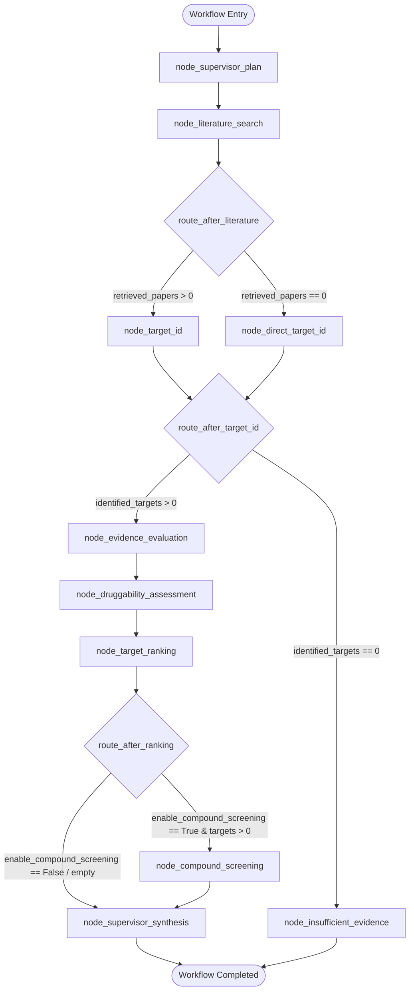

# Architecture & State Machine Specification

## Overview

The **Drug Discovery & Target Identification Agent** coordinates multi-agent investigation workflows using **LangGraph**. The execution model is structured as a state machine where specialized agents process, annotate, and transform a shared immutable-by-convention state object (`ResearchGraphState`).

---

## Shared Graph State Model (`ResearchGraphState`)

The state dictionary is defined in [`src/domain/state.py`](../src/domain/state.py) using TypedDict with Pydantic model serialization:

```python
class ResearchGraphState(TypedDict):
    # Session & Query Metadata
    session_id: str
    research_question: str
    disease_name: Optional[str]
    disease_efo_id: Optional[str]
    current_stage: WorkflowStage
    status: str
    step_count: int
    max_steps: int

    # Core Investigation Data Collections
    retrieved_papers: List[Dict[str, Any]]
    identified_targets: Dict[str, Dict[str, Any]]
    evidence_records: List[Dict[str, Any]]
    druggability_assessments: Dict[str, Dict[str, Any]]
    experimental_data_matches: Dict[str, List[Dict[str, Any]]]
    known_active_compounds: Dict[str, List[Dict[str, Any]]]
    compound_screenings: Dict[str, List[Dict[str, Any]]]
    target_rankings: List[Dict[str, Any]]

    # Workflow Control & Execution Telemetry
    scoring_weights: Dict[str, float]
    enable_compound_screening: bool
    top_n_targets_to_screen: int
    max_literature_results: int
    errors: List[Dict[str, Any]]
    audit_trace: List[Dict[str, Any]]
    executive_summary: Optional[str]
```

---

## State Transition Topology



---

## Deterministic Scoring Engine

To eliminate LLM score hallucination, target prioritization is executed by [`TargetScoringEngine`](../src/engine/scoring.py) outside of the LLM.

### Sub-Score Formulations

1. **Disease Association ($s_1 \in [0, 100]$)**:
   - Evaluates direct disease-target connection from Open Targets overall association score or normalized literature mentions.
2. **Genetic Association ($s_2 \in [0, 100]$)**:
   - Evaluates causal variants, GWAS loci, and ClinVar significance. Non-genetic targets receive a baseline of $0.0$.
3. **Target Tractability ($s_3 \in [0, 100]$)**:
   - Evaluates clinical and discovery precedence across modalities:
     - Small Molecule clinical precedence: $95.0$ pts
     - Monoclonal antibody clinical precedence: $90.0$ pts
     - High-confidence druggable pocket: $55.0$ pts
     - Unassessed baseline: $25.0$ pts
4. **Literature Support ($s_4 \in [0, 100]$)**:
   - Logarithmically scaled citation volume based on peer-reviewed PubMed publications:
     $$s_4 = \min\left(100.0, 20.0 \cdot \ln(1 + N_{\text{citations}})\right)$$
5. **Internal Validation ($s_5 \in [0, 100]$)**:
   - Wet-lab assay validations (CRISPR knockout, RNA-seq, SPR) weighted by statistical significance ($p < 0.05$) and QC pass flags.
6. **Safety & Toxicity Profile ($s_6 \in [0, 100]$)**:
   - Baseline $100.0$ pts, with explicit point deductions for flagged off-target liabilities, black-box warnings, or systemic toxicities.

### Contradiction Penalty

When conflicting publications report opposing directions of biological effect (e.g. protective vs. risk-increasing), a penalty $P \in [15.0, 30.0]$ is deducted from the target's composite score.

---

## Fault Tolerance & Degradation Policies

1. **Exponential Backoff**:
   - External clients (`NcbiPubMedClient`, `OpenTargetsClient`, `ChEMBLClient`) implement retry pacing on HTTP 429 (rate-limit) and transient 5xx responses.
2. **Graceful Fallbacks**:
   - If an external endpoint is unreachable, structured fallback routines populate fallback data without aborting the graph execution.
3. **Loop Protection**:
   - `ResearchGraphState.step_count` is incremented on every transition. If `step_count >= max_steps` (default 25), the workflow routes immediately to `node_supervisor_synthesis` to summarize available data.
